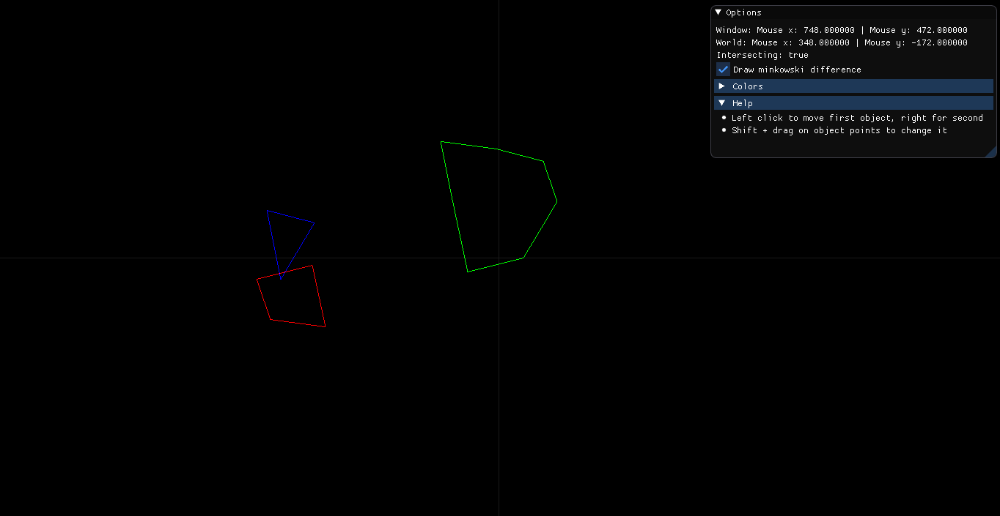

# GJK-visualization
GJK algorithm visualization using OpenGL, GLFW and Dear ImGui

## About
This is simple visualization of GJK(Gilbert-Johnson-Keerthi) algorithm determining the minimum distance between two convex sets. More about it you can find [there](https://en.wikipedia.org/wiki/Gilbert–Johnson–Keerthi_distance_algorithm).
Now is only implemented determining intersection between convex sets and visualization of Minkowski difference

Source code of GJK algorithm located in GJK-visualization/src/gjk.h file

## Run
There is precompiled executables for Windows located in WinBin folder